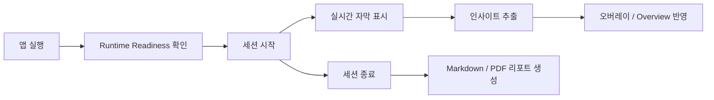

# Meeting Overlay Assistant

[](https://github.com/shinyeonjun/meeting-overlay-assistant)
[](https://fastapi.tiangolo.com/)
[](https://tauri.app/)
[](https://github.com/SYSTRAN/faster-whisper)

로컬 AI 기반으로 회의 음성을 실시간 보조 자막과 인사이트로 보여주고, 회의 종료 후 최종 리포트를 Markdown/PDF로 정리하는 회의 보조 시스템입니다.

## 미리보기


## 한눈에 보기

- 문제: 회의 중에는 말을 놓치기 쉽고, 회의 후에는 정리 비용이 크다
- 해법: 실시간 자막과 인사이트를 보여주고, 종료 후 리포트를 자동 생성한다
- 현재 단계: 동작하는 MVP
- 핵심 포인트: 로컬 실행, 하이브리드 STT, 이벤트 관리 API, PDF 리포트 생성

## 왜 만드는가

회의 중에는 말을 놓치지 않게 도와주고, 회의 후에는 결정사항과 액션 아이템을 바로 문서로 남기는 것이 목표입니다.

이 프로젝트는 아래 두 문제를 동시에 해결하려고 합니다.

- 회의 중: 다시 묻지 않아도 되도록 실시간 자막과 인사이트를 제공
- 회의 후: 회의 내용을 다시 정리하지 않아도 되도록 리포트를 자동 생성

## 핵심 기능

- 실시간 STT
  - `partial`/`final` 자막 표시
  - `mic`, `system_audio`, `mic_and_audio` 입력 source 지원
- 실시간 인사이트 추출
  - `question`, `decision`, `action_item`, `risk`
  - 이벤트 목록 조회, 수정, 삭제 API 제공
- 리포트 생성
  - Markdown/PDF 생성
  - 버전 관리 및 재생성 API 제공
  - 최종 리포트 상태 조회 지원
- 오버레이 UI
  - Tauri 기반 데스크톱 오버레이
  - readiness 확인 후 세션 시작

## 현재 동작 흐름

```text
앱 실행
  -> frontend / backend / STT readiness 확인
  -> ready 상태에서 세션 시작 가능
  -> 세션 시작 후에만 live audio 전송
  -> 실시간 자막 / 인사이트 표시
  -> 세션 종료
  -> 최종 리포트 생성 및 조회
```

## 서비스 플로우



## 아키텍처 개요

```text
Audio Input
  -> Live Capture (Tauri / Browser)
  -> STT Pipeline
      - partial: Sherpa / Web Speech API
      - final: Faster-Whisper
  -> Insight Analyzer
  -> Session Overview / Overlay UI
  -> Report Builder
      - Markdown
      - PDF
```

## 기술 스택

| 구분 | 스택 |
|---|---|
| Backend | Python, FastAPI, SQLite |
| Frontend | Vanilla JS, Vite, Tauri |
| STT | Web Speech API, Sherpa, Faster-Whisper |
| Analysis | Rule-based + LLM 혼합 구조 |
| Report | Markdown, PDF |

## 현재 구현 상태

### 구현됨

- 실시간 STT 및 overview API
- 이벤트 추출 및 이벤트 관리 API
- Markdown/PDF 리포트 생성
- 리포트 버전 관리 및 재생성 API
- startup readiness 기반 세션 시작 gating

### 진행 중

- 실시간 자막 품질 튜닝
- 오버레이 UX 개선
- live 인사이트와 최종 리포트 경로 분리 고도화

## 빠른 실행

### 1) 백엔드

```powershell
cd D:\caps
python -m venv venv
.\venv\Scripts\Activate.ps1
pip install -r requirements-app.txt
pip install -r requirements-dev.txt
uvicorn backend.app.main:app --reload
```

### 2) 오버레이

```powershell
cd D:\caps\frontend
npm install
npm run overlay:tauri:dev
```

## 주요 API

- `GET /api/v1/runtime/readiness`
- `POST /api/v1/sessions`
- `POST /api/v1/sessions/{session_id}/end`
- `GET /api/v1/sessions/{session_id}/overview`
- `GET /api/v1/sessions/{session_id}/events`
- `PATCH /api/v1/sessions/{session_id}/events/{event_id}`
- `POST /api/v1/reports/{session_id}/markdown`
- `POST /api/v1/reports/{session_id}/pdf`
- `POST /api/v1/reports/{session_id}/regenerate`

상세 스펙은 [docs/architecture/api.md](/D:/caps/docs/architecture/api.md)에서 확인할 수 있습니다.

## 저장소 구조

```text
backend/
  app/           # 실행 코드
  experiments/   # 실험 코드
  scripts/       # 실행/운영 스크립트

frontend/
  overlay/       # Tauri 오버레이 앱

docs/
  architecture/  # 아키텍처 / API / DB
  product/       # 요구사항 / 정책 / UIUX
  research/      # STT 조사 / 전략 / 벤치마크
  internal/      # 내부 메모 / 백로그 / 스프린트
```

## 문서

- 문서 인덱스: [docs/README.md](/D:/caps/docs/README.md)
- 아키텍처: [docs/architecture](/D:/caps/docs/architecture)
- 제품 문서: [docs/product](/D:/caps/docs/product)
- 연구 문서: [docs/research](/D:/caps/docs/research)
- 내부 문서: [docs/internal](/D:/caps/docs/internal)

## 저장소 운영 원칙

- 실행 코드는 `backend/app`, `frontend/overlay/src`에만 추가
- 실험 코드는 `backend/experiments`에만 추가
- 내부 메모는 `docs/internal`에만 추가
- 로컬 산출물, DB, 모델, 로그는 Git에서 제외
- 설정은 `.env.example`만 추적

## 로드맵

- [ ] 실시간 자막 품질 안정화
- [ ] 인사이트 precision/recall 검증 루프 구축
- [ ] PDF 리포트 레이아웃 고도화
- [ ] 오버레이 UX 마감
- [ ] 최종 데모 시나리오 정리
