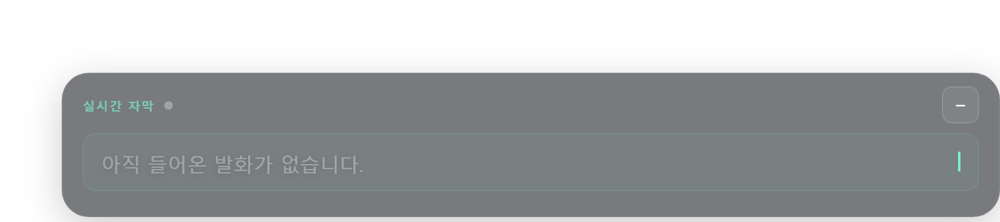
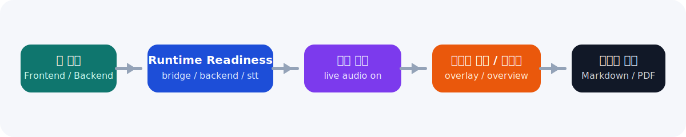

# Meeting Overlay Assistant

[](https://github.com/shinyeonjun/meeting-overlay-assistant)
[](https://fastapi.tiangolo.com/)
[](https://tauri.app/)
[](https://github.com/SYSTRAN/faster-whisper)

로컬 환경에서 회의 음성을 실시간 자막으로 보여주고, 세션 종료 후 저장된 오디오로 고정밀 전사를 다시 수행해 Markdown/PDF 리포트를 생성하는 회의 보조 MVP입니다.

## 미리보기



## 현재 동작

- 세션 시작 전 `runtime readiness`를 확인합니다.
- 실시간 자막은 `system_audio` 또는 `mic` 입력을 받아 표시합니다.
- 실시간 인사이트는 질문만 노출합니다.
- 세션 종료는 종료만 수행합니다. 리포트는 자동 생성하지 않습니다.
- 리포트 생성은 세션 탭에서 수동으로 실행합니다.
- 리포트 생성 시 세션 녹음 파일을 자동으로 찾아 고정밀 STT 기반 분석을 수행합니다.
- 리포트 산출물은 세션별 폴더에 정리됩니다.

## 서비스 흐름



### 실시간 경로

1. 세션 시작
2. 입력 소스 연결
3. Sherpa 기반 partial/fast-final 자막 표시
4. 질문 이벤트만 실시간 보드에 반영

### 리포트 경로

1. 세션 종료
2. 세션 탭에서 형식 선택
3. `리포트 생성` 실행
4. 저장된 세션 오디오 기반 고정밀 STT 수행
5. 구조화 분석 후 Markdown/PDF 생성

## UI 구조

- `세션` 탭
  - 세션 시작/종료
  - readiness 상태
  - 현재 주제/경과 시간
  - 리포트 형식 선택 및 수동 생성
- `이벤트` 탭
  - 질문/결정/액션 아이템/리스크 목록
  - 카드 액션은 `수정`, `처리 완료`만 사용

## 리포트 저장 구조

```text
backend/data/reports/{session_id}/
  markdown.v1.md
  pdf.v1.pdf
  artifacts/
    markdown.v1.transcript.md
    markdown.v1.analysis.json
    pdf.v1.transcript.md
    pdf.v1.analysis.json
```

세션 녹음 파일은 `backend/data/recordings/` 아래에 임시로 저장되며 Git 추적 대상에서 제외됩니다.

## 실행

### 백엔드

```powershell
python -m venv venv
.\venv\Scripts\activate
pip install -r requirements-app.txt
uvicorn backend.app.main:app
```

개발 중 STT 모델 경로가 꼬이지 않도록 `--reload` 없이 실행하는 편이 안전합니다.

### 프론트엔드

```powershell
cd frontend
npm install
npm run overlay:tauri:dev
```

## 문서

- [문서 인덱스](docs/README.md)
- [API 문서](docs/architecture/api.md)
- [구조 문서](docs/architecture/구조.md)
- [UI/UX 명세](docs/product/오버레이_UIUX명세.md)

## 현재 우선순위

1. 리포트 분석 품질 개선
2. 이벤트 추출 precision 개선
3. 실시간 STT 안정성 및 체감 품질 개선
