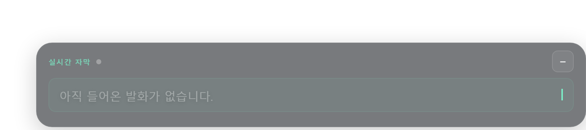

# CAPS — Meeting Overlay Assistant

[](https://github.com/shinyeonjun/meeting-overlay-assistant/actions/workflows/ci.yml)
[](docs/architecture/db.md)
[](https://fastapi.tiangolo.com/)
[](https://tauri.app/)

> **기간:** 2026.03–2026.06 · **형태:** 개인 프로젝트 · **범위:** 오버레이 클라이언트, 실시간 통신 서버, 워크스페이스 흐름과 STT 이벤트 구조를 직접 설계·구현

CAPS는 회의 중에는 빠른 정보 확인을 위한 desktop overlay를, 회의 후에는 기록·리포트·retrieval을 위한 web workspace를 제공하는 로컬 AI 회의 보조 제품입니다.



## 문제

회의 플랫폼마다 자막·상태·기록·후속 업무 기능이 분리되어 있어, 회의 중 필요한 정보를 확인하고 회의 후 기록을 다시 활용하는 흐름이 끊깁니다. CAPS는 회의 중 보조와 회의 후 기록 활용을 하나의 시스템으로 연결하는 것을 목표로 했습니다.

## 만든 것

```text
Meeting runtime
      ↓
Tauri overlay
      ↓
FastAPI control/live APIs
      ├─ PostgreSQL + pgvector
      └─ Redis report worker
              ↓
       Web workspace
```

- 회의 중 live caption, 상태, 핵심 이벤트를 표시하는 Tauri overlay
- 회의 후 history, report, retrieval(pgvector + 전문검색 하이브리드 검색)을 제공하는 web workspace
- FastAPI control/live API와 PostgreSQL/pgvector 저장·검색 경계
- Redis 기반 report worker와 비동기 처리 흐름
- 회의 중 오버레이와 partial/final 자막 이벤트 구조

## 직접 구현한 범위

- 오버레이 클라이언트와 실시간 통신 흐름 설계
- FastAPI control API/live runtime 경계 구성
- STT 모델 배치와 partial/final 이벤트 흐름 정리
- 핵심 이벤트 추출과 회의 기록 저장 구조 설계
- 회의 후 workspace·history·report·retrieval 흐름 연결

## 현재 공식 구조

- `server/`: FastAPI 서버, PostgreSQL / pgvector, report worker
- `client/overlay/`: Tauri 기반 회의 중 HUD
- `client/web/`: 회의 후 workspace / history / report / 검색 UI
- `client/shared/`: 프런트 공용 API / auth / runtime 코드
- `shared/`: 서버와 클라이언트가 공유하는 계약
- `deploy/`: 로컬 실행 및 배포용 스크립트
- `docs/`: 제품·아키텍처·운영 문서

초기 버전(`backend/`, `frontend/`)은 저장소에서 제거했으며, 필요하면 git 기록에서 확인할 수 있습니다.

## 실행 엔트리포인트

- 통합 서버: `server.app.main:app`
- Control API 전용: `server.app.entrypoints.control_api:app`
- Live Runtime 전용: `server.app.entrypoints.live_api:app`
- Overlay 클라이언트: `client/overlay`
- Web workspace: `client/web`

## 역할 분리

- `overlay`: 빠른 세션 생성, 시작/종료, 라이브 자막, 상태, 핵심 이벤트 요약
- `web`: history, report, retrieval, 후속 정리
  (`assistant` 화면은 현재 LLM 대화가 아니라 retrieval 검색 결과를 보여줍니다.)
- `server`: control API / live runtime / worker 방향으로 분리

## Quick start

Windows와 PowerShell 기준입니다. 개발 인프라는 Docker Desktop이 실행 중이어야 하며, 설정값은 루트와 각 client의 `.env.example`을 참고합니다.

### 1. 서버 의존성 설치

```powershell
python -m venv venv
.\venv\Scripts\activate
pip install -r requirements-app.txt
```

### 2. PostgreSQL, pgvector, Redis 실행

```powershell
powershell -ExecutionPolicy Bypass -File .\scripts\dev-infra.ps1 up
```

### 3. 통합 서버와 클라이언트 실행

```powershell
powershell -ExecutionPolicy Bypass -File .\scripts\dev-server.ps1
powershell -ExecutionPolicy Bypass -File .\scripts\dev-client.ps1
```

전체 개발 stack은 다음 명령으로 실행할 수 있습니다.

```powershell
powershell -ExecutionPolicy Bypass -File .\scripts\dev-stack.ps1
```

필요하면 web 또는 report worker를 제외할 수 있습니다.

```powershell
powershell -ExecutionPolicy Bypass -File .\scripts\dev-stack.ps1 -SkipWeb
powershell -ExecutionPolicy Bypass -File .\scripts\dev-stack.ps1 -SkipReportWorker
```

### 분리 엔트리포인트

```powershell
powershell -ExecutionPolicy Bypass -File .\scripts\dev-server.ps1 -EntryPoint server.app.entrypoints.control_api:app
powershell -ExecutionPolicy Bypass -File .\scripts\dev-server.ps1 -Port 8012 -EntryPoint server.app.entrypoints.live_api:app
powershell -ExecutionPolicy Bypass -File .\scripts\dev-report-worker.ps1
```

## Engineering boundaries

- 운영 런타임 DB: `PostgreSQL only`
- 개발 인프라: `dev-infra.ps1` + `docker-compose.infrastructure.yml`
- 테스트 DB: `TEST_POSTGRESQL_DSN` 기준 별도 `caps_test`
- retrieval / memory: `PostgreSQL + pgvector`
- 비동기 작업: `Redis + worker`
- 로컬 파일 경로 직접 참조는 점진적으로 `artifact id` 기반으로 정리 중

## 알려진 한계와 다음 개선

- 스키마는 마이그레이션 도구 없이 SQL 파일(`server/app/infrastructure/persistence/postgresql/`)로 관리하며, 일부 변경을 `ADD COLUMN IF NOT EXISTS`로 덧붙이고 있습니다. → Alembic 기반 단일 baseline으로 정리할 예정입니다.
- 시각 컬럼 상당수가 `TEXT`로 저장되어 job lease 만료를 문자열로 비교합니다. → `TIMESTAMPTZ`로 전환할 예정입니다.
- 트랜잭션마다 새 psycopg 연결을 엽니다. → `psycopg_pool` 도입이 필요합니다.
- WebSocket 연결 처리 경로에 동기 DB 호출이 남아 있습니다. → `asyncio.to_thread` 또는 async 드라이버로 분리할 예정입니다.
- 기본 설정은 `AUTH_ENABLED=false`입니다. 실제 배포 시에는 인증을 켜야 합니다.
- CI(PostgreSQL + pgvector)에서 서버 테스트 447개가 통과합니다. 코드 변경을 따라가지 못했거나 외부 LLM 서버·Windows 경로를 가정하는 테스트 26개는 [`tests/known_failures.txt`](tests/known_failures.txt)에 명시하고 CI에서 임시로 제외했습니다. 하나씩 고치면서 목록에서 지울 예정입니다.

## Project map

- 개발 스크립트: [scripts/README.md](scripts/README.md)
- 클라이언트 구조: [client/README.md](client/README.md)
- 서버 구조: [server/README.md](server/README.md)
- 문서 허브: [docs/README.md](docs/README.md)

## Further reading

- 구조: [docs/architecture/구조.md](docs/architecture/구조.md)
- DB: [docs/architecture/db.md](docs/architecture/db.md)
- PG / pgvector / Redis: [docs/architecture/pg_redis_vector_설계.md](docs/architecture/pg_redis_vector_설계.md)
