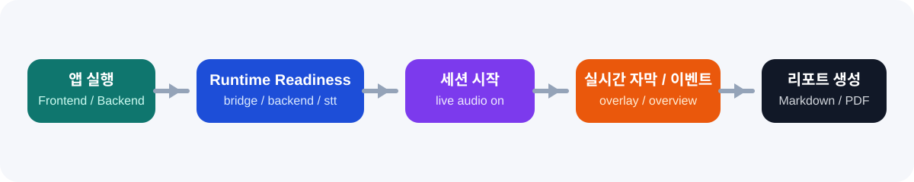

# CAPS — Meeting Overlay Assistant

[](docs/architecture/db.md)
[](https://fastapi.tiangolo.com/)
[](https://tauri.app/)

CAPS는 회의 중에는 빠른 정보 확인을 위한 desktop overlay를, 회의 후에는 기록·리포트·retrieval을 위한 web workspace를 제공하는 로컬 AI 회의 보조 제품입니다.


## What it demonstrates

- 회의 중 live caption, 상태, 핵심 이벤트를 한 화면에서 다루는 Tauri overlay
- 회의 후 history, report, retrieval, assistant 흐름을 분리한 web workspace
- FastAPI와 PostgreSQL/pgvector, Redis worker를 조합한 API·검색·비동기 작업 경계

```text
Meeting runtime -> Overlay -> FastAPI control/live APIs -> PostgreSQL + pgvector
                                      |-> Redis report worker -> Web workspace
```

현재 공식 경로는 `server / client / shared / deploy`이며 `backend / frontend`는 레거시 참조 경로입니다.



## 현재 공식 구조

- `server/`: FastAPI 서버, PostgreSQL / pgvector, report worker
- `client/overlay/`: Tauri 기반 회의 중 HUD
- `client/web/`: 회의 후 workspace / history / report / assistant UI
- `client/shared/`: 프런트 공용 API / auth / runtime 코드
- `shared/`: 서버와 클라이언트가 공유하는 계약
- `deploy/`: 로컬 실행 및 배포용 스크립트
- `docs/`: 제품 / 아키텍처 / 운영 문서

## 실행 엔트리포인트

- 통합 서버: `server.app.main:app`
- Control API 전용: `server.app.entrypoints.control_api:app`
- Live Runtime 전용: `server.app.entrypoints.live_api:app`
- Overlay 클라이언트: `client/overlay`
- Web workspace: `client/web`

## 역할 분리

- `overlay`: 빠른 세션 생성, 시작/종료, 라이브 자막, 상태, 핵심 이벤트 요약
- `web`: history, report, retrieval, assistant, 후속 정리
- `server`: control-api / live-runtime / worker 방향으로 분리

## Quick start

Windows와 PowerShell 기준입니다. 개발 인프라는 Docker Desktop이 실행 중이어야 하며, 설정값은 루트와 각 client의 `.env.example`을 참고합니다.

### 1. 서버 의존성 설치

```powershell
python -m venv venv
.\venv\Scripts\activate
pip install -r requirements-app.txt
```

### 2. PostgreSQL, pgvector, Redis 실행

```powershell
powershell -ExecutionPolicy Bypass -File .\scripts\dev-infra.ps1 up
```

### 3. 통합 서버 실행

```powershell
powershell -ExecutionPolicy Bypass -File .\scripts\dev-server.ps1
```

### 4. 클라이언트 실행

```powershell
powershell -ExecutionPolicy Bypass -File .\scripts\dev-client.ps1
```

Web workspace만 실행하려면:

```powershell
powershell -ExecutionPolicy Bypass -File .\scripts\dev-client.ps1 -Target web
```

### 5. 전체 개발 stack 실행

```powershell
powershell -ExecutionPolicy Bypass -File .\scripts\dev-stack.ps1
```

필요하면 web 또는 report worker를 제외할 수 있습니다.

```powershell
powershell -ExecutionPolicy Bypass -File .\scripts\dev-stack.ps1 -SkipWeb
powershell -ExecutionPolicy Bypass -File .\scripts\dev-stack.ps1 -SkipReportWorker
```

### 6. 분리 엔트리포인트 실행

```powershell
powershell -ExecutionPolicy Bypass -File .\scripts\dev-server.ps1 -EntryPoint server.app.entrypoints.control_api:app
powershell -ExecutionPolicy Bypass -File .\scripts\dev-server.ps1 -Port 8012 -EntryPoint server.app.entrypoints.live_api:app
powershell -ExecutionPolicy Bypass -File .\scripts\dev-report-worker.ps1
```

## Engineering boundaries

- 운영 런타임 DB: `PostgreSQL only`
- 개발 인프라: `dev-infra.ps1` + `docker-compose.infrastructure.yml`
- 테스트 DB: `TEST_POSTGRESQL_DSN` 기준 별도 `caps_test`
- retrieval / memory: `PostgreSQL + pgvector`
- 비동기 작업: `Redis + worker`
- 로컬 파일 경로 직접 참조는 점진적으로 `artifact id` 기반으로 정리 중

## Project map

- 개발 스크립트: [scripts/README.md](scripts/README.md)
- 클라이언트 구조: [client/README.md](client/README.md)
- 서버 구조: [server/README.md](server/README.md)
- 문서 허브: [docs/README.md](docs/README.md)

## Further reading

- 구조: [docs/architecture/구조.md](docs/architecture/구조.md)
- DB: [docs/architecture/db.md](docs/architecture/db.md)
- PG / pgvector / Redis: [docs/architecture/pg_redis_vector_설계.md](docs/architecture/pg_redis_vector_설계.md)
